# 📈 StockTrader — MERN Stack Stock Trading Platform

A full-stack virtual stock trading platform where users get **$10,000 virtual money** to practice buying and selling real stocks in a simulated environment.

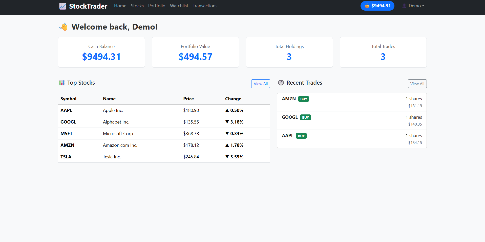

---

## 🌐 Live Demo

| App | URL | Status |
|---|---|---|
| 🖥️ Frontend (User App) | [stock-traders.vercel.app](https://stock-traders.vercel.app) | ✅ Live |
| 📊 Admin Dashboard | [stock-traders-6qzo.vercel.app](https://stock-traders-6qzo.vercel.app) | ✅ Live |
| 🔧 Backend API | [stocktraders-ghrw.onrender.com](https://stocktraders-ghrw.onrender.com) | ✅ Live |

> ⚠️ **Note:** Backend is hosted on Render free tier — first request may take ~30 seconds to wake up.

---

## 🛠️ Tech Stack

| Layer | Technology |
|---|---|
| **Frontend** | React.js, Bootstrap 5, Material UI, HTML/CSS |
| **Backend** | Node.js, Express.js, REST API |
| **Database** | MongoDB (Atlas Cloud) |
| **Authentication** | JWT (JSON Web Tokens) |
| **Testing** | Jest + Supertest + mongodb-memory-server |
| **Deployment** | Render (Backend) + Vercel (Frontend + Dashboard) |

---

## ✨ Features

### 👤 User Features
- ✅ Register & Login with JWT authentication
- ✅ Start with **$10,000 virtual money**
- ✅ Browse 10 stocks with **live simulated price changes**
- ✅ **Buy & Sell stocks** with real-time balance update
- ✅ **Portfolio tracking** with P&L calculation
- ✅ Full **transaction history**
- ✅ **Watchlist** to monitor favorite stocks
- ✅ Protected routes with token-based auth

### 🔐 Admin Features
- ✅ Secure admin-only login
- ✅ Dashboard with stats, charts (Buy vs Sell, Top Stocks)
- ✅ View and manage all users (enable/disable/delete)
- ✅ View all platform transactions with filters

---

## 📸 Screenshots

### 🔐 User Authentication

#### Login Page
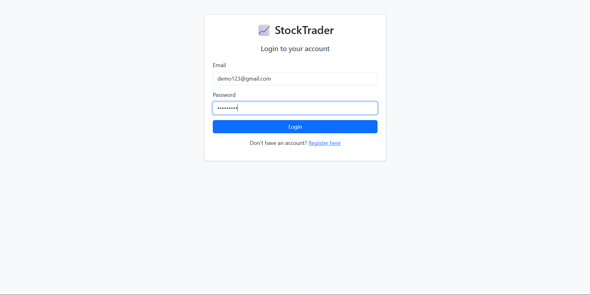

#### Register Page
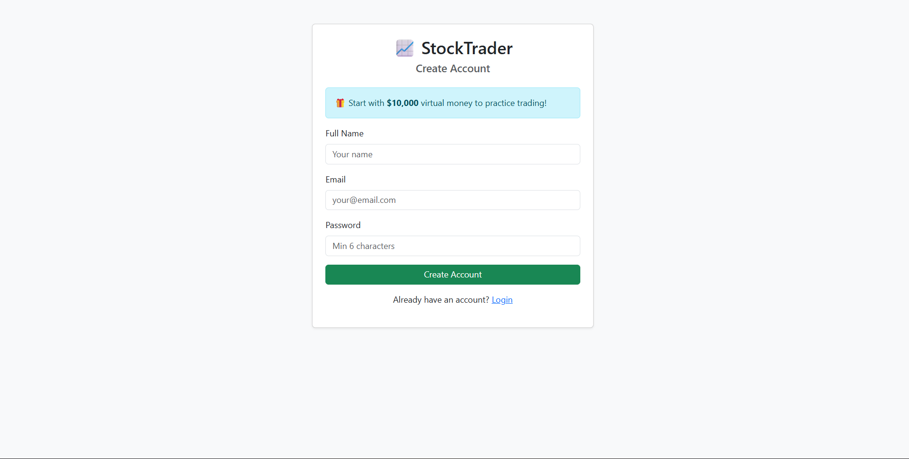

---

### 🏠 User Dashboard
> Overview of balance, portfolio value, holdings, and recent trades


---

### 📊 Stock Market Page
> Browse all 10 stocks with live prices, change %, volume and Buy/Sell buttons

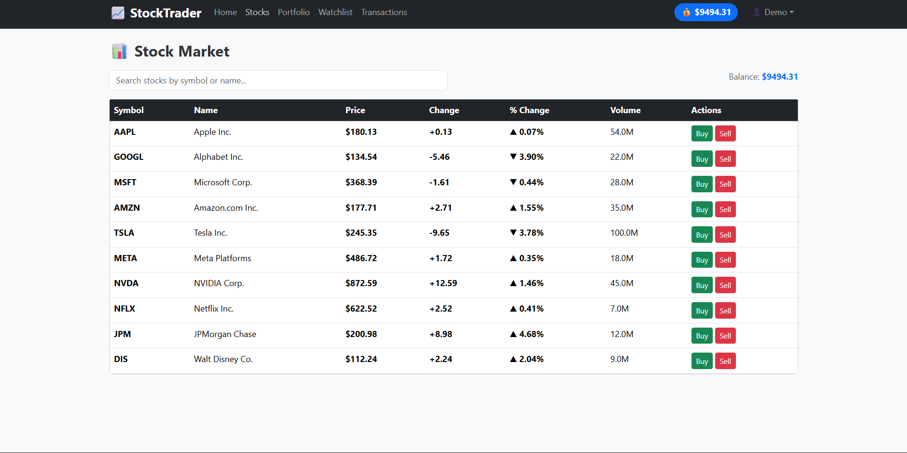

---

### 🟢 Buy Stock
> Click Buy on any stock — enter quantity, see total, confirm purchase

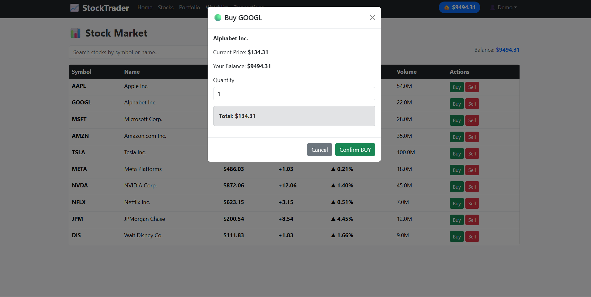

---

### 🔴 Sell Stock
> Click Sell — same modal with red confirm button

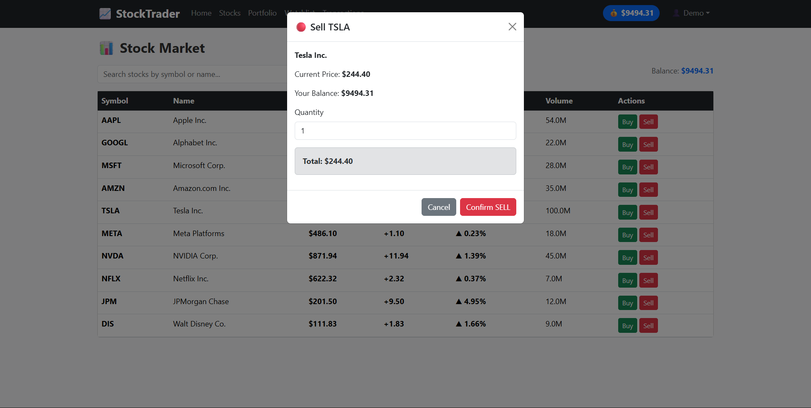

---

### 💼 Portfolio Page
> Track all holdings with avg buy price, current price and P&L

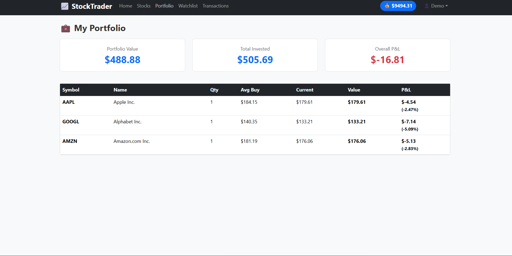

---

### 📋 Transaction History
> Full history of all buy and sell trades with dates and totals


---

### ⭐ Watchlist
> Save stocks to monitor without buying — add/remove anytime

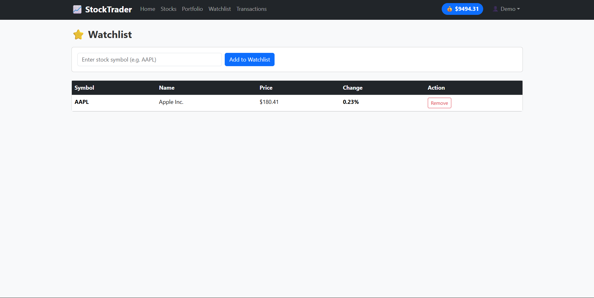

---

### 🛡️ Admin Panel

#### Admin Login
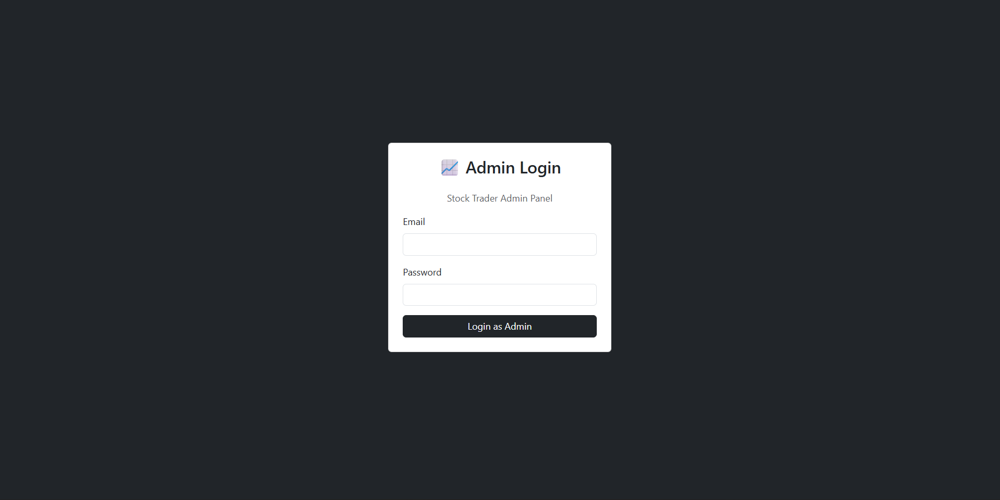

#### Admin Dashboard
> Stats cards, Buy vs Sell bar chart, Top Traded Stocks pie chart, Recent transactions

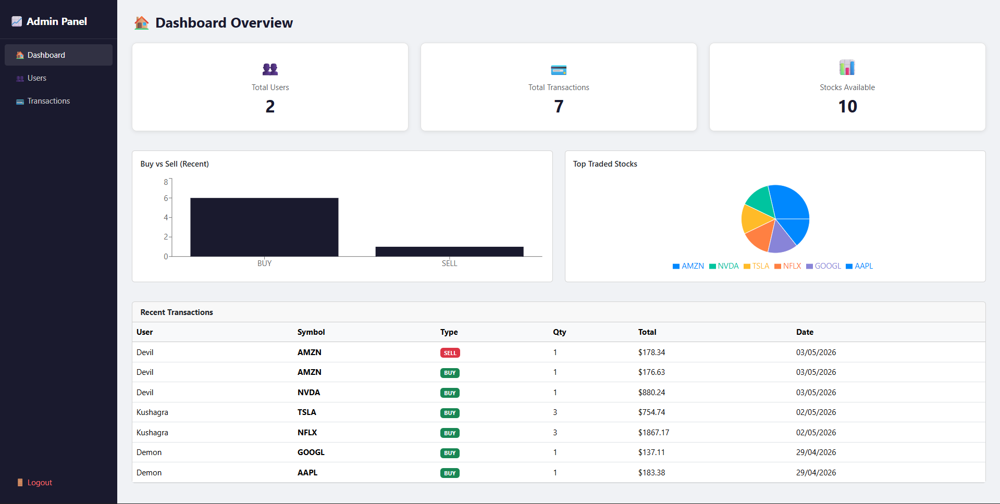

#### Manage Users
> View all users with balance, role, status — enable/disable/delete accounts

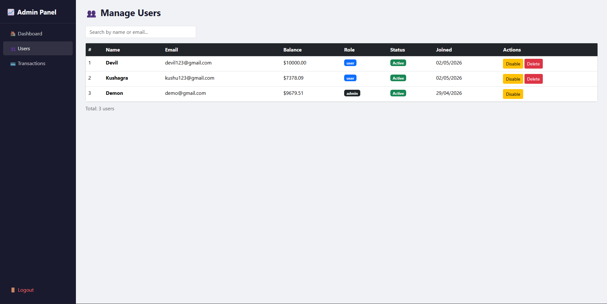

<<<<<<< HEAD
#### All Transactions
> Filter by ALL / BUY / SELL — see every trade across all users
=======

>>>>>>> dd0c5658d9b6b8fe22cbdce19f8ac498bdce75df


---

## 📁 Project Structure

```
stock-trading-platform/
│
├── backend/                          # Node.js + Express API
│   ├── models/
│   │   ├── User.js                   # User schema (balance, role)
│   │   ├── Stock.js                  # Stock schema (price, change)
│   │   ├── Portfolio.js              # Holdings per user
│   │   ├── Transaction.js            # Buy/Sell history
│   │   └── Watchlist.js              # Saved stocks per user
│   ├── routes/
│   │   ├── auth.js                   # Register, Login, Me
│   │   ├── stocks.js                 # Get all stocks, single stock
│   │   ├── portfolio.js              # Buy, Sell, Get portfolio
│   │   ├── transactions.js           # Get transaction history
│   │   ├── watchlist.js              # Add/Remove/Get watchlist
│   │   └── admin.js                  # Admin: users, stats
│   ├── middleware/
│   │   └── auth.js                   # JWT protect + adminOnly
│   ├── tests/
│   │   ├── auth.test.js              # Jest test suite (23 tests)
│   │   └── jest.setup.js             # mongodb-memory-server setup
│   └── server.js                     # Express app entry point
│
├── frontend/                         # React User App (port 3000)
│   └── src/
│       ├── context/AuthContext.js    # JWT auth + axios config
│       ├── components/Navbar.js      # Navigation with balance
│       └── pages/
│           ├── Login.js
│           ├── Register.js
│           ├── Home.js
│           ├── Stocks.js
│           ├── Portfolio.js
│           ├── Transactions.js
│           └── Watchlist.js
│
├── dashboard/                        # React Admin Panel (port 3001)
│   └── src/
│       ├── components/Sidebar.js
│       └── pages/
│           ├── AdminLogin.js
│           ├── DashboardHome.js      # Charts + stats
│           ├── Users.js              # User management
│           └── AllTransactions.js    # All trades + filters
│
├── Screenshots/                      # App screenshots
├── .github/workflows/main.yml        # CI/CD GitHub Actions
├── render.yaml                       # Render deployment config
├── RENDER_VERCEL_DEPLOYMENT.md       # Deployment guide
└── README.md
```

---

## ⚙️ Local Setup

### Prerequisites
- Node.js v16+
- MongoDB (local) or MongoDB Atlas account
- Git

### 1. Clone the Repository

```bash
git clone https://github.com/YOUR_USERNAME/stock-trading-platform.git
cd stock-trading-platform
```

### 2. Backend Setup

```bash
cd backend
npm install
cp .env.example .env
```

Edit `.env`:
```env
PORT=5000
MONGO_URI=mongodb://localhost:27017/stocktrading
JWT_SECRET=mysecretkey123456
JWT_EXPIRE=7d
NODE_ENV=development
```

```bash
npm run dev
# ✅ MongoDB Connected!
# ✅ Server running on port 5000
```

### 3. Frontend Setup

```bash
cd frontend
npm install
npm start
# ✅ Opens at http://localhost:3000
```

### 4. Dashboard Setup

```bash
cd dashboard
npm install
npm start
# Press Y when asked about different port
# ✅ Opens at http://localhost:3001
```

### 5. Make Yourself Admin

```bash
mongosh
use stocktrading
db.users.updateOne({ email: "your@email.com" }, { $set: { role: "admin" } })
exit
```

---

## 🧪 Running Tests

```bash
cd backend
npm install
npm test
```

**Test Coverage:**
- ✅ User registration (success + failure cases)
- ✅ Login (correct + wrong credentials)
- ✅ JWT token validation
- ✅ Protected route access
- ✅ Portfolio, transactions, watchlist routes
- ✅ Admin access control (403 for non-admins)

> Tests use `mongodb-memory-server` — no real database or `.env` needed!

```
Tests:  23 passed, 23 total
```

---

## ☁️ Deployment

### Backend → Render

| Setting | Value |
|---|---|
| Root Directory | `backend` |
| Build Command | `npm install` |
| Start Command | `node server.js` |
| Environment | `NODE_ENV=production` |

### Frontend & Dashboard → Vercel

| Setting | Value |
|---|---|
| Root Directory | `frontend` or `dashboard` |
| Framework | Create React App |
| Environment Variable | `REACT_APP_API_URL=https://your-render-url.onrender.com` |

See full guide in [RENDER_VERCEL_DEPLOYMENT.md](RENDER_VERCEL_DEPLOYMENT.md)

---

## 🌿 GitHub Branches

| Branch | Purpose |
|---|---|
| `main` | Production-ready code |
| `dev` | Active development |
| `feature/frontend` | Frontend features |
| `feature/backend` | Backend features |
| `feature/dashboard` | Admin dashboard features |
| `hotfix` | Emergency bug fixes |

```bash
# Auto-create all branches
bash setup-git-branches.sh
```

---

## 📡 API Endpoints

### Auth
| Method | Endpoint | Description |
|---|---|---|
| POST | `/api/auth/register` | Register new user |
| POST | `/api/auth/login` | Login user |
| GET | `/api/auth/me` | Get current user |

### Stocks
| Method | Endpoint | Description |
|---|---|---|
| GET | `/api/stocks` | Get all stocks |
| GET | `/api/stocks/:symbol` | Get single stock |

### Portfolio
| Method | Endpoint | Description |
|---|---|---|
| GET | `/api/portfolio` | Get user portfolio |
| POST | `/api/portfolio/buy` | Buy a stock |
| POST | `/api/portfolio/sell` | Sell a stock |

### Transactions
| Method | Endpoint | Description |
|---|---|---|
| GET | `/api/transactions` | Get trade history |

### Watchlist
| Method | Endpoint | Description |
|---|---|---|
| GET | `/api/watchlist` | Get watchlist |
| POST | `/api/watchlist/add` | Add stock |
| DELETE | `/api/watchlist/:symbol` | Remove stock |

### Admin (🔐 Admin only)
| Method | Endpoint | Description |
|---|---|---|
| GET | `/api/admin/users` | Get all users |
| GET | `/api/admin/stats` | Get platform stats |
| PUT | `/api/admin/users/:id/toggle` | Enable/Disable user |
| DELETE | `/api/admin/users/:id` | Delete user |

---

## 💰 Cost — 100% Free

| Service | Free Tier |
|---|---|
| Render | 750 hrs/month |
| Vercel | Unlimited deploys |
| MongoDB Atlas | 512MB storage |

**Total monthly cost: $0** 🎉

---

## 👨‍💻 Author

**Kushagra**
- GitHub: [@kushagra9926](https://github.com/kushagra9926)

---

<<<<<<< HEAD
=======
Made with ❤️ as a college MERN stack project
>>>>>>> dd0c5658d9b6b8fe22cbdce19f8ac498bdce75df
